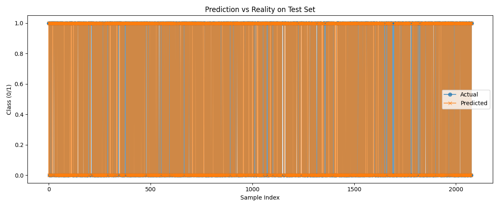

# Stock Market Price Prediction Using Random Forest

Predicting the direction of stock prices is a challenging and exciting problem that blends time-series analysis, technical indicators, and machine learning.  
This repository provides a **full implementation of the research paper**:

> [Stock Market Price Prediction Using Random Forest](https://arxiv.org/pdf/1605.00003v1)

You’ll find the entire pipeline: preprocessing with exponential smoothing, extracting technical indicators, a from-scratch Random Forest classifier, and rich evaluation visualizations.

**➡️ [Read the full step-by-step Medium article here](https://usman-haider.medium.com/predicting-stock-market-movement-with-technical-indicators-and-random-forest-step-by-step-python-2d797d5c7b24)**

---

## Features

- **Data Preprocessing:** Exponential smoothing, moving average, and RSI smoothing for noise reduction.
- **Feature Extraction:** Technical indicators including RSI, MACD, Stochastic Oscillator, Williams %R, PROC, and OBV.
- **Custom Random Forest Classifier:** Built from scratch, no sklearn black-box!
- **Visualization:** Plots for predictions vs. reality, predicted probabilities, ROC/AUC, PCA for linear separability, and more.
- **Fully reproducible:** Modular, easy to run or extend.

---

## Quickstart

```bash
git clone https://github.com/osman-haider/stock-market-prices-prediction-using-RF
cd stock-market-prices-prediction-using-RF/src/main
python main.py
```
- Place your stock data CSV (e.g., `AAPL.csv`) in the `/Data` directory or adjust the path in `main.py`.
- All result images will be saved in the `/graphs` folder after running.

---

## Example Results

### Prediction vs Reality



---

### ROC Curve


---

## Full Project Structure

- `main.py` — Orchestrates preprocessing, feature extraction, training, evaluation, and plotting.
- `preprocessing.py` — All data cleaning and smoothing logic.
- `Feature_Extraction.py` — Computes technical indicators.
- `RandomForest.py`, `DecisionTree.py` — Custom ensemble classifier code.
- `Graphs.py` — All plotting utilities.
- `/graphs` — Contains all generated result images.

---

## Reference

- **Research Paper:**  
  [Stock Market Price Prediction Using Random Forest](https://arxiv.org/pdf/1605.00003v1)

- **Step-by-Step Article:**  
  [How I Implemented Stock Price Prediction with Random Forest — Full Python Guide](https://usman-haider.medium.com/predicting-stock-market-movement-with-technical-indicators-and-random-forest-step-by-step-python-2d797d5c7b24)

---

## License

MIT License

---

**If you find this project helpful, please give it a ⭐ and share your results!**  
For any questions or contributions, open an issue or pull request.

---

*Happy Coding & Investing!*
